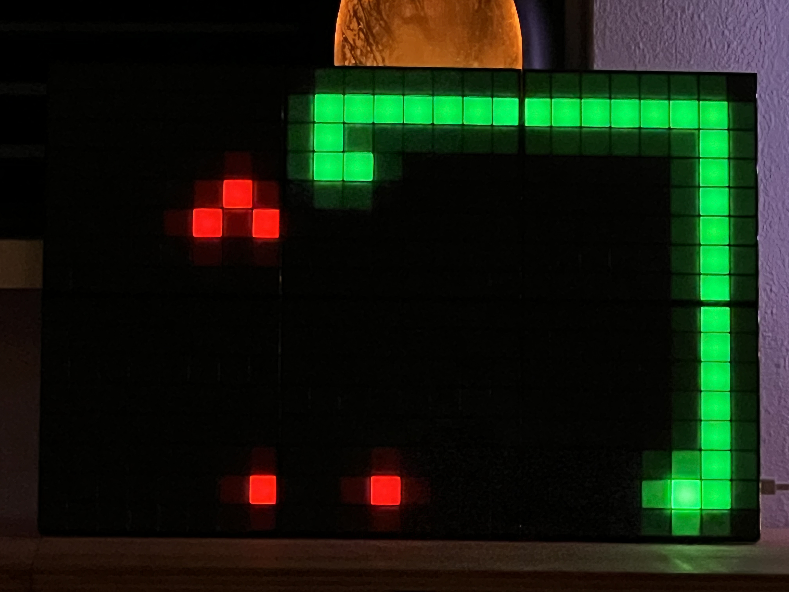
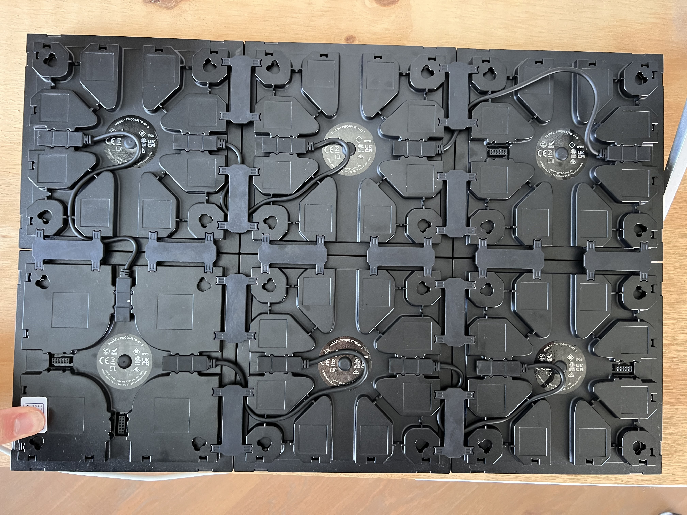

# Snake Game for Twinkly LED Board
Snake for the Twinkly led matrix

This Python program allows you to play the classic Snake game on a Twinkly LED board. It uses the Twinkly LED board to display the game grid and the snake.



## Prerequisites

Before you can run this program, make sure you have the following:

1. [Twinkly LED board](https://www.twinkly.com/)
2. Python 3.x installed on your system. I dit use Python3 3.9.6 on a macbook pro M1
3. The following Python libraries installed:
   - xled
   - io
   - struct
   - time
   - random
   - keyboard
   - requests

You can install the required libraries using pip:

```bash
pip install xled keyboard requests
```

#How to Play

   - Connect your Twinkly LED board to your computer.
   - Run the Python script, and the Snake game will start on your LED board.
   - ```bash sudo python3 twinkly_snake.py``` I needed to add sudo to use the keyboard in OSX.
   - Use the arrow keys or 'W', 'A', 'S', 'D' to control the snake's direction.
   - Eat the red or yellow food to increase your score.
   - Avoid colliding with the yourself.
   - If you have a text to speach system, you can play the score after a game over your sound system. (see the last lines of code for that)

#LED Matrix Configuration

The game grid is configured for a 6-tile Twinkly LED board. 
See my image for the correct tile and cable setup.
If you have a different configuration, you may need to adjust the led_matrix in the code to match your setup.

#LED Matrix Cable setup
if you don't do this the same, the snake will move onlogical over the tiles :-)



